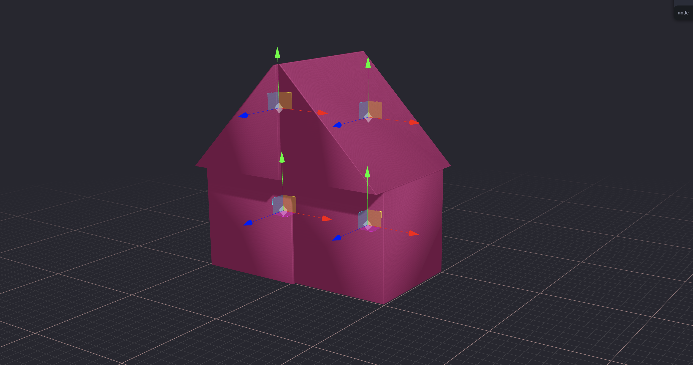
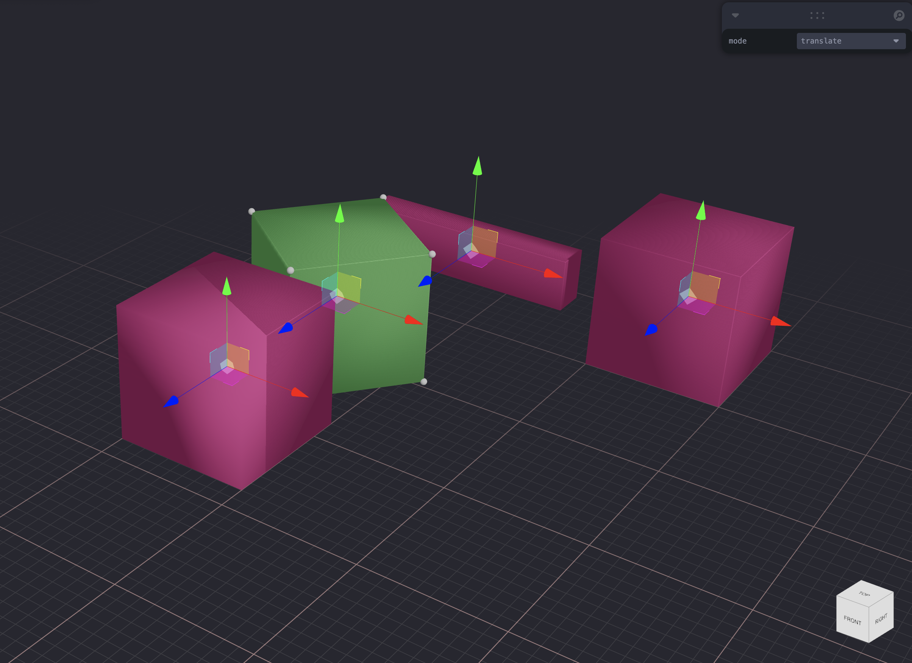
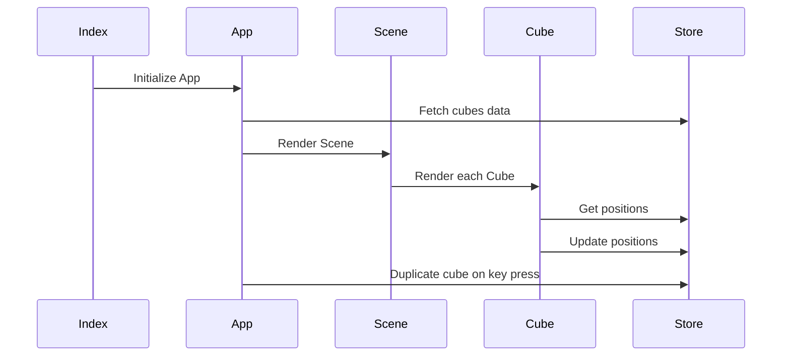
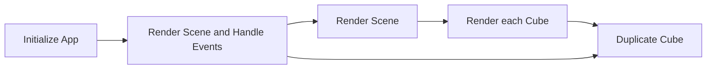

# Welcome to ƐDit!

3D Edit is a interactive space to interact with cube(s), edit it and duplicate the same.

A React Three Fiber application utilizing Zustand for state management and Leva for UI controls to dynamically manipulate 3D cubes and their vertices with intuitive TransformControls.

## Features

The 3D Environmentallows interactive manipulation of 3D cubes and their vertices. Users can duplicate, translate, rotate, or scale the cubes and vertices with real-time visual feedback.

|FEATURES                |Control                         |Explanation                       
|----------------|-------------------------------|-----------------------------|
|Transform Controls|`Default`            |One can Translate (Move), Rotate and Scale the 3D Object (Cube)            |
|Selection          |`Click`            |To select the geometry, click it.           |
|Copy /Dupicate         |`Press'c'`|To copy the Cube. Bonus- The selected geometry get Copy-- which means you can copy the editted cube.|
|Grid        |`Default`|Grids are laid for better understanding of scale and dimensions.|
|Edit Cube      |`Click Cube`|One can editth Vertex of the Cube.|
|Gizmo Cube      |`Default`|Gizmo Cube helps to navigate the Interface faster. One can move 3D in plan, elevations, etc..|
|Orbit Controls    |`Default - Right click > Pan |  Left  click > Orbit |  Scroll > Zoom in/out`|Intitutive 3D Interface and interaction|
## Technical Structure

> **Note:** This is **general explanation** of the code. May not cover every detail.

**App.tsx**
The App component sets up the 3D scene using React Three Fiber and integrates various Drei components for controls and visualization aids. It renders a Canvas with Scene, lighting, and controls, while also handling keyboard events to duplicate cubes.

*Scene Component:* Renders cubes managed by useMeshStore, allowing transformations based on the mode selected via Leva controls.
*Grid Configuration:* Provides customization for the grid displayed in the scene.

**Cube.tsx**
The Cube component represents individual cubes with spheres as vertices. It uses refs for managing spheres, mesh, and control states, enabling transformation controls on click events.

*TransformControls:* Attached to either the selected sphere or the whole cube for translating, rotating, or scaling.
*useEffect:* Updates geometry when positions change and handles TransformControls events.

**store.ts**
The Zustand store (useMeshStore) manages the state of cubes, their positions, selected spheres, and meshes.

*CubeState & MeshState:* Defines the state structure for cubes and provides actions like adding, duplicating cubes, and setting positions or selections.

**index.tsx**
Initializes the React application and renders the App component into the DOM.

> Demo Video coming soon: [Youtube Demo](http://google.com/).

Highlevel:
> These diagrams ingores the loops that runs through various actions.

